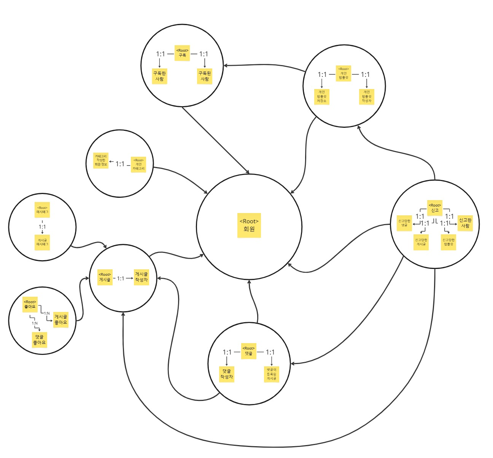

# MarkTory, 기술을 넘어 이야기를 담는 공간

 

# :cherry_blossom: 봄이오조 :cherry_blossom:

<table>
  <tr>
    <td></td>
    <td></td>
    <td></td>
    <td></td>
    <td></td>
    <td></td>
  </tr>
  <tr>
    <td>:crown:주아현</td>
    <td>강이도은</td>
    <td>곽우석</td>
    <td>이상모</td>
    <td>정동한</td>
    <td>한윤상</td>
  </tr>
</table>

 

## 목차 
1. [개요](#개요)    
2. [주요 기능](#주요-기능)
3. [WBS](#WBS)
4. [요구사항 명세서](#요구사항-명세서)
5. [DDD](#DDD)
6. [DB 모델링](#DB-모델링)
7. [서버 구조](#서버-구조)  
8. [테스트 케이스](#테스트-케이스)
9. [팀 회고](#팀-회고)

# 📌 개요

> 자기 PR의 시대, 나만의 개발자 공간을 만들다. 지루한 기술 블로그에서 벗어나 자유롭게 글을 작성하고, 나만의 스타일로 PR할 수 있는 공간!
(  )은 Markdown 기반으로 간편하게 블로그를 운영하고, 개발자 간 소통과 네트워킹을 지원합니다. 기술을 공유하는 것에서 한 걸음 더 나아가, Markdown 템플릿을 통해 나만의 색깔을 표현하고 성잘할 수 있는 커뮤니티를 제공합니다. 이제 개발자의 글쓰기는 단순한 기록이 아닌, 개인의 브랜딩과 연결되는 새로운 경험이 됩니다. 쉽고 자유로운 글쓰기, 더 넓은 개발자 네트워크! 지금 (  )와 함께 나만의 공간을 만들어보세요.

 

##  개발 배경
### 1️⃣ 개발자 블로그의 한계와 PR 공간의 부재
기술 블로그는 개발자의 성장과 지식 공유의 필수적인 도구이지만, 기존 플랫폼은 개발자 친화적인 기능 부족, 네트워크 제한, Markdown 지원 미흡 등의 문제를 가지고 있습니다. 또한, 개인 포트폴리오와 연결된 자기 PR 공간이 부족하여 개발자들이 자신의 기술력을 효과적으로 표현하기 어려운 상황입니다. 이에 따라, Markdown 기반의 블로그와 PR 페이지를 결합한 새로운 플랫폼이 필요합니다.

### 2️⃣ 자유로운 글쓰기와 네트워킹의 필요성
개발자들은 기술 공유뿐만 아니라 템플릿을 활용한 효율적인 글 작성, 네트워크 형성, 피드백 교류를 원합니다. 하지만 기존 블로그 플랫폼은 구독, 템플릿 공유, 개발자 간 연결 기능이 부족하여 단순한 글쓰기 공간에 머물러 있습니다. 따라서, 개발자들이 기술을 공유하면서도 서로 연결될 수 있는 새로운 커뮤니티가 필요합니다.

 

## 📋주요 기능
### 1️⃣ Markdown 기반의 간편한 글쓰기
개발자들이 익숙한 Markdown 문법을 사용하여 손쉽게 글을 작성하고 관리할 수 있습니다.

### 2️⃣ 커스터마이징 가능한 템플릿
다양한 템플릿을 제공하여 사용자가 자신의 스타일에 맞게 블로그를 꾸밀 수 있습니다.

### 3️⃣ 개발자 네트워킹 지원
다른 개발자들의 블로그를 구독하고, 댓글과 피드백을 주고받으며, 협업의 기회를 넓힐 수 있습니다.

### 4️⃣ 포트폴리오 연동
작성한 글과 프로젝트를 포트폴리오와 연동하여 자신의 기술력을 효과적으로 PR할 수 있습니다.

 

## 💡 차별성

### 1️⃣ 개발자 중심의 기능 제공
기존 플랫폼들이 가지는 Markdown 지원 미흡, 제한적인 커스터마이징 등의 문제를 해결하여 개발자 친화적인 환경을 제공합니다.

### 2️⃣ 네트워킹과 커뮤니티 강화
단순한 블로깅을 넘어 개발자 간의 소통과 협업을 촉진하는 기능을 제공합니다.

 

# WBS

 

# 요구사항 명세서

 

# DDD
### 1️⃣ Bounded Context

### 2️⃣ Context Mapping

 

# DB 모델링
### 1️⃣ 플로우차트

### 2️⃣ 논리모델링

### 3️⃣ 물리모델링

 

# 서버 구조

 

# 테스트 케이스

 

# 팀 회고
### 주아현
| Team Member | Peer Review |
|-------------|------------|
| 강이도은      | 평가       |
| 곽우석       | 평가       |
| 이상모       | 평가       |
| 정동한       | 평가       |
| 한윤상       | 평가       |

### 강이도은
| Team Member | Peer Review |
|-------------|------------|
| 주아현       | 평가       |
| 곽우석       | 평가       |
| 이상모       | 평가       |
| 정동한       | 평가       |
| 한윤상       | 평가       |

### 곽우석
| Team Member | Peer Review |
|-------------|------------|
| 주아현       | 평가       |
| 강이도은      | 평가       |
| 이상모       | 평가       |
| 정동한       | 평가       |
| 한윤상       | 평가       |

### 이상모
| Team Member | Peer Review |
|-------------|------------|
| 주아현       | 평가       |
| 강이도은      | 평가       |
| 곽우석       | 평가       |
| 정동한       | 평가       |
| 한윤상       | 평가       |

### 정동한
| Team Member | Peer Review |
|-------------|------------|
| 주아현       | 평가       |
| 강이도은      | 평가       |
| 곽우석       | 평가       |
| 이상모       | 평가       |
| 한윤상       | 평가       |

### 한윤상
| Team Member | Peer Review |
|-------------|------------|
| 주아현       | 평가       |
| 강이도은      | 평가       |
| 곽우석       | 평가       |
| 이상모       | 평가       |
| 정동한       | 평가       |
